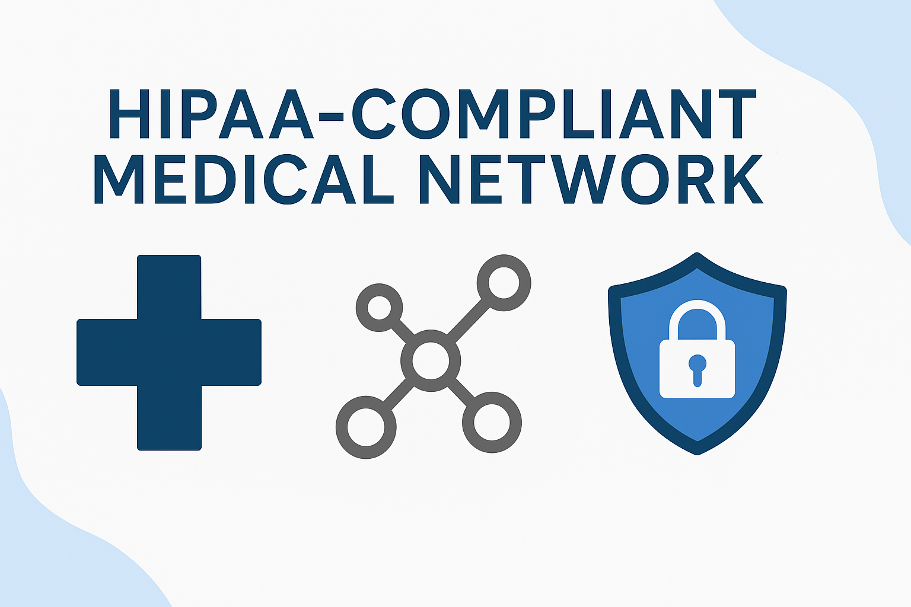

# 🏥 HIPAA-Compliant Medical Office Network Redesign

## 📌 Project Overview
This project simulates a real-world engagement where four separate medical offices—East, West, Accounting, and Small—merged into a single connected network infrastructure. The goal was to redesign the existing insecure topology, correct HIPAA and FERPA compliance violations, and provide secure access for patients, staff, and physicians across all locations. The redesign was built using Cisco Packet Tracer and presented to both non-technical staff and a simulated HIPAA auditor.

> 🔒 This project combines routing, switching, wireless segmentation, and firewall fundamentals to achieve a scalable and secure healthcare network.

---

## 🛠 Tools & Technologies
- **Cisco Packet Tracer** (network simulation)
- **Cisco ASA Firewall** (simulated security controls)
- **DHCP / DNS / VLAN Segmentation**
- **Access Point Configuration (Patient vs. Staff)**
- **IP Addressing & Subnetting**
- **PowerPoint** (Non-technical & technical stakeholder presentations)

---

## ⚙️ Key Design Goals
- 🚧 Eliminate HIPAA and FERPA compliance issues
- 🔐 Isolate sensitive patient data using VLANs and firewall segmentation
- 🌐 Provide patient access to public Wi-Fi without exposing internal systems
- 🖥️ Allow staff to use BYOD while enforcing access controls
- 📶 Equip each office with reliable wireless and wired connectivity
- 📈 Design a scalable network that supports future office expansions

---

## 🏢 Office-by-Office Changes

### 🔹 Small Office
- Added firewall and VLAN rules to limit access for patients and staff
- Installed server and dual-access wireless points (staff vs. guest)

### 🔹 Accounting Office
- Added second server for data redundancy
- Segmented access points for BYOD and guest devices
- Implemented restrictions to isolate financial data

### 🔹 East Office
- Introduced VLAN-based segmentation for staff and patient zones
- Enabled secure wireless for staff BYOD and patient guests
- Upgraded topology to increase reliability

### 🔹 West Office
- Restructured topology for better routing and switching
- Applied access restrictions and enabled secure device access

---

## 🖥️ Network Architecture

Each office connects through a simulated cloud to represent WAN integration. Security and reliability were addressed by:
- Centralized firewall rules and ACLs
- Switch port security on core and access switches
- Simulated redundant links for future failover implementation
- Separation of internal and public-facing networks

---

## 📄 Files Included

| File | Description |
|------|-------------|
| `CIS207L_Project Overview.docx` | Full project prompt and constraints |
| `CIS207L Project (1).pkt` | Initial design with basic interconnectivity |
| `Final Version 207L.pkt` | Final secured version with VLANs, firewall, and segmentation |
| `Medical Office Merger.pptx` | Non-technical presentation for staff and management |

---

## 📈 Outcomes
- Transformed an unsecure, violation-prone network into a HIPAA-compliant infrastructure
- Demonstrated secure access models for patients and staff
- Provided a scalable foundation for future medical offices to be added
- Delivered both technical and non-technical presentations for simulated stakeholders

---

## 👤 Author
**Nazir Terrell**  
Security+ Certified | Cybersecurity Graduate  
🔗 [LinkedIn](https://www.linkedin.com/in/nazir-terrell-40a05b217)

---

## ✅ License
All content is for educational demonstration and ethical use only. No real patient data or production systems were involved in this project.

